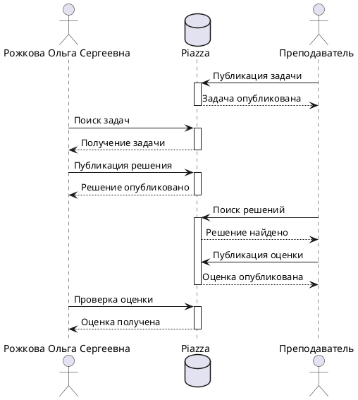

# Практическое занятие №7 "Генераторы документации"
Выполнила **Рожкова Ольга**, группа **ИКБО-62-23** 
---
## Задача №1

Реализовать с помощью математического языка LaTeX формулу. Прислать код на LaTeX и картинку-результат, где, помимо формулы, будет указано ФИО студента.

### Решение

Код на LaTeX: 

```latex
\documentclass{article}
\usepackage{amsmath}
\usepackage[utf8]{inputenc}
\usepackage[russian]{babel}

\begin{document}

Рожкова Ольга Сергеевна

\[
\int_{x}^{\infty} \frac{dt}{t(t^{2}-1) \log t} = \int_{x}^{\infty} \frac{1}{t \log t} \left( \sum_{m} t^{-2m} \right) dt = \sum_{m} \int_{x}^{\infty} \frac{t^{-2m}}{t \log t} dt \quad (u = t^{-2m}) = -\sum_{m} \operatorname{li}(x^{-2m})
\]

\end{document}
```
Полученная формула:


## Задача №2

На языке PlantUML реализовать диаграмму на рисунке ниже. Прислать текст на PlantUML и картинку-результат, в которой ФИО студента заменены Вашими собственными. Обратите внимание на оформление, желательно придерживаться именно его, то есть без стандартного желтого цвета и проч. Чтобы много не писать используйте псевдонимы с помощью ключевого слова "as".

### Решение

Код на PlantUML:


Полученное изображение:


